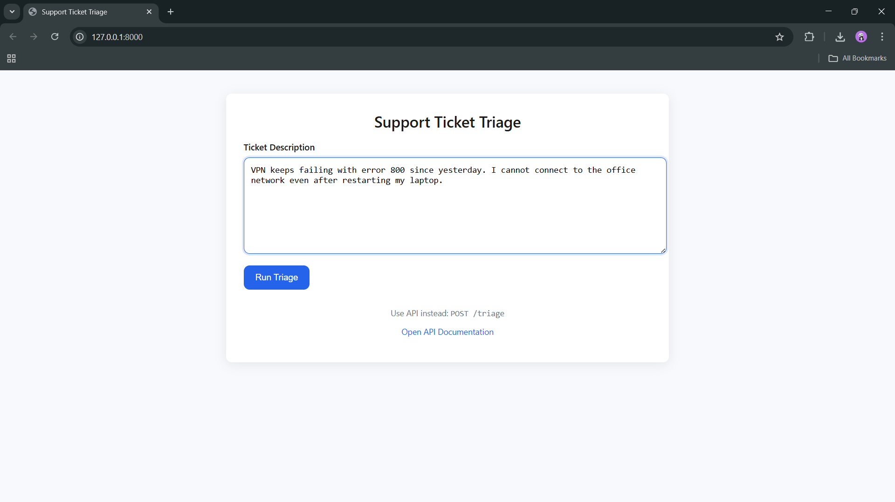
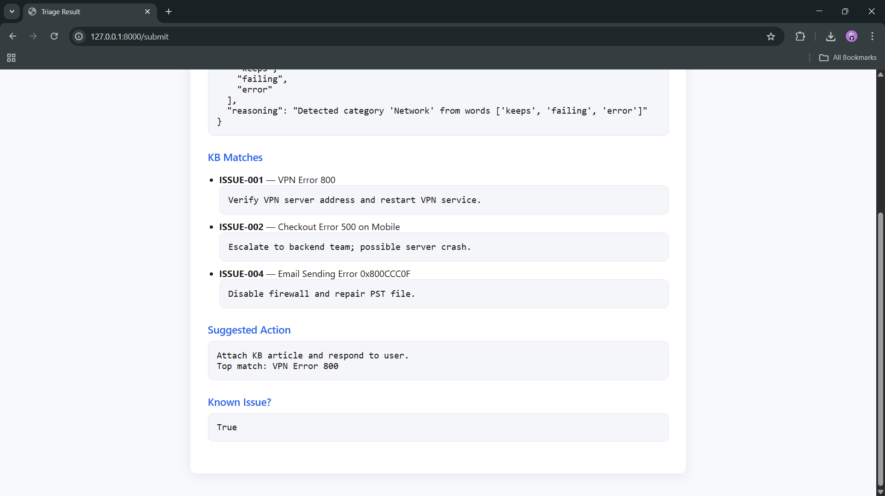

# Support Ticket Triage Agent

A lightweight AI-driven service that classifies support tickets, searches a local knowledge base, and recommends next steps.  
Built with FastAPI, BM25, and a pluggable LLM provider (mock by default; real Gemini/Groq can be enabled).

---

## How to Run Locally

### Prerequisites

- Python 3.11
- Conda (recommended)
- pip installed
- Port 8000 available

### Install Dependencies

```bash
conda create -n triage python=3.11 -y
conda activate triage
pip install -r requirements.txt
```

### Start the Service

```bash
uvicorn app.main:app --reload --port 8000
```

**Your app will run at:**  
[http://127.0.0.1:8000/](http://127.0.0.1:8000/)

**API Docs:**  
[http://127.0.0.1:8000/docs](http://127.0.0.1:8000/docs)

**UI:**  
[http://127.0.0.1:8000/](http://127.0.0.1:8000/)

---

## Call the `/triage` Endpoint

**Example — Linux/macOS**

```bash
curl -X POST "http://127.0.0.1:8000/triage" \
  -H "Content-Type: application/json" \
  -d '{"text": "VPN error 800 cannot connect"}'
```

**Example — Windows PowerShell**

```powershell
Invoke-RestMethod -Method POST "http://127.0.0.1:8000/triage" `
  -Headers @{ "Content-Type" = "application/json" } `
  -Body '{ "text": "VPN error 800 cannot connect" }'
```

---

## Folder Structure

```
Support-Ticket-Triage-Agent/
├── app/
│   ├── main.py
│   ├── config.py
│   ├── schemas.py
│   └── services/
│       ├── agent.py
│       ├── kb.py
│       └── provider.py
├── data/
│   └── kb.json
├── templates/
│   ├── index.html
│   └── result.html
├── requirements.txt
├── Dockerfile
└── README.md
```

---

## Dockerfile (Run as a Container)

**Build:**
```bash
docker build -t triage-agent .
```

**Run:**
```bash
docker run -p 8000:8000 triage-agent
```

**Service is available at:**  
[http://127.0.0.1:8000/](http://127.0.0.1:8000/)

---

## Agent Design

### How the LLM is Used

The provider analyzes text and extracts:
- Summary
- Category
- Severity
- Key entities
- Reasoning

> A MockProvider is used by default for offline/local development.  
> The provider layer is modular: Switch to Gemini / Groq by changing environment variables only.

### How KB Search / Tools Work

- Uses BM25 lexical search (`rank_bm25`) for lightweight retrieval.
- Searches the local `kb.json` for top 1–3 similar issues.
- No embeddings or vector DBs required — ideal for low-RAM environments.

### Trade-offs Made Due to Time

- BM25 chosen instead of semantic search for simplicity and speed.
- Mock LLM used by default to avoid API key requirements.
- Rate limiting is in-memory (sufficient for demo; Redis recommended for production).
- UI intentionally simple (server-rendered HTML).

---

## Bonus Features Implemented

This project includes all optional enhancements requested in the assignment:

- ✅ **Retry + Error Handling for LLM Calls**  
  Implemented a retry decorator with exponential backoff. Provider failures (timeouts/network issues) are safely handled.

- ✅ **Rate Limiting + Request Validation**  
  Per-IP in-memory rate limiting. Input validation for empty/invalid text. Protects the API from request flooding.

- ✅ **Small Professional HTML UI**  
  Clean, modern, minimal Jinja2-based interface. Users can submit tickets and see full triage output visually.

- ✅ **Support for Multiple Environments (dev/prod)**  
  Uses `.env.development` and `.env.production`. Environment loaded dynamically via config. Easy to switch between mock provider and real cloud LLMs.

---

## Production Considerations

### Deployment (AWS/GCP/Azure)

Build Docker image → deploy to:
- AWS ECS/Fargate
- GCP Cloud Run
- Azure App Service
- Kubernetes (GKE/EKS/AKS)

Enable autoscaling (HPA, Cloud Run concurrency).

### Logging / Monitoring

- Use JSON structured logs.
- Recommended:
  - CloudWatch / Stackdriver / Azure Monitor
  - Prometheus + Grafana
  - OpenTelemetry for traces

### Configuration & Secrets

- **NEVER** store API keys in code.
- Use:
  - AWS Secrets Manager
  - GCP Secret Manager
  - Azure Key Vault
  - Kubernetes Secrets
- `.env` only for local development.

### Latency, Cost, Rate Limiting

- BM25 ensures instant KB lookup.
- LLM usage minimized → cost efficient.
- Rate limiting avoids provider overuse.
- Real LLM calls can be cached for identical tickets.

---

## Demo Notes

You may include screenshots to demonstrate the UI and result:

### 1️⃣ Input Screen

_Add image showing ticket text being entered._

### 2️⃣ Result Screen

_Add image showing structured JSON: analysis, KB matches, suggested action._

Place screenshots in a folder like:

/screenshots/input.png
/screenshots/result.png

Reference them in your README:
markdown



---
